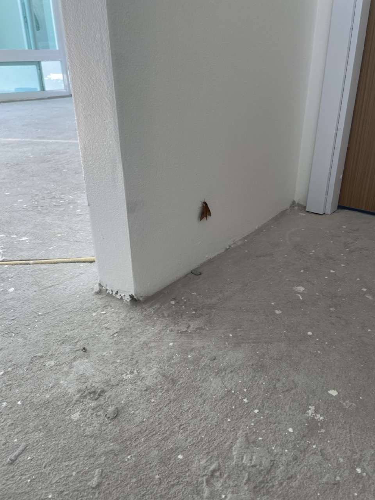

# 241220 ฝ้า ทำความสะอาด และท่อ U

> หนึ่งวัน พันกว่าเรื่อง มาบ่นๆว่าทำอะไรบ้างเฉยๆ ไม่รู้ว่าจะเหมาะไหมกับการเล่าเรื่องชีวิตตัวเองลงบล็อค แต่มันมีหลายๆเรื่องที่ดูมีประโยชน์ ก็เลยอยากเอามาแชร์

*ทั้งหมดนี้ ไม่ได้เรียงเวลาตามวัน อันไหนนึกได้ก่อนก็พิมก่อน*

ฝ้า upvc ที่เป็น clip lock อย่าลืมว่าถ้าจะใส่คราวหน้า ให้เอาตัวจบมันมาด้วย (น่าจะชื่อว่า L Lock) จะได้ไม่ต้องมาทำเหมือนช่างฝ้าที่ต้องเอาน้อตมาเจาะกับ c line ทีละตัวๆ วุ่นวายตาย

เก็บของตอนนี้ก็เริ่มแยกเป็นหมวดหมู่ อันไหนยาวๆ เหม็นๆก็เอาไปใส่ในช่องเก็บของหน้าบ้านแทน

ที่เหม็นมานานคือกระป๋องทินเนอร์ ต้องหมั่นเช็คให้เรียบร้อยว่ามีเปิดฝาไม่สนิทไหม

วันนี้สิงห์มอตาร์เขามาเช็คว่าพื้นจะขัดได้ไหม พื้นมีสองแบบ skim กับแบบ roller (แบบใหม่แม่ดูมาจากติ้กต่อก) พี่เขาแนะนำเป็น skim เพราะทำเร็วง่ายบาง

เขาชมบ้านด้วย ชอบสวนเปิดกลางบ้านมาก แนะนำพื้นที่เขากับบ้านขาวๆที่แม่ชอบได้ น่าจะเป็นคนชอบสไตล์เดียวกัน

เอาของไปเปลี่ยน พี่ต่ายคือรับเปลี่ยนได้แม้กระทั่งอยู่บ้าน ส่งกายละเอียดมาเซ็นเอาของไปคืนได้ เซลดีมีชัยไปกว่าครึ่ง ไม่ปวดหัว

ไอเซลไทวัสดุสู้ไม่ได้เลย เมื่อวานก็คือส่งเรื่องทำ yale ไม่ได้ แถมมางอแงว่ามันเปลี่ยน แล้วฉันไปตรัสรู้ไหม แถมให้หาใบเสร็จอีก ก็ยังอยู่ข้างนอกอะจ้า ไปโวยวายก็เลยได้มา

yale โทรมาติดต่อวันนี้ ว่าจะเข้ามาวันเสาร์ ตอนสิบโมง จริงๆตอนแรกว่าจะให้ไปตอนบ่ายแต่คิดๆดูแล้วก็ไปเลยดีกว่า เพราะจะได้เสร็จเร็วๆ ไปทำอะไรต่อได้ (แต่จะตื่นไหมก่อน)

ไปคุยกับ wefit ไทวัสดุเรื่องติดตั้งอ่างน้ำ ispa เขาก็แนะนำว่าให้ทางแบรนด์เขาไปติดจะดีกว่า เขาเคยมีเคสว่า ลูกค้าให้ไปติดแล้วแบรนด์ก็ต้องมาสำรวจพื้นที่อีกรอบ กลายเป็นเสียสองเด้ง เขาเลยไม่เสี่ยงติดให้ดีกว่า เดี๋ยวเขาติดต่อกลับมา (มีไลน์)

ปริ้นสีที่ไทวัสดุ 5 บาทสีต่อแผ่น ก็แพงเหมือนกันแถมได้คุณภาพไม่ได้ดีเลย ปริ้น inkjet ธรรมดาอะ ก็รู้สึกว่าถ้ามีเครื่องปริ้นสีเลเซอร์ดีๆใช้ก็จะดี หรือ inkjet แบบปริ้นสีเนียนๆได้ (อันนี้อาจจะไม่ดีตรงกระดาษด้วย) แต่ว่าไม่ได้ปริ้นบ่อยอะ มาปริ้นเขาใช้ในราชการไม่ใช่ไปขายงาน ไม่เป็นไรหรอก ประหยัดๆ

เอองงว่าทำไมบ้านเราถึงไม่ใช่ระบบ email กันแล้ววะ ไปปริ้นก็ต้องให้แอดไลน์ มันแบบ ถ้าไม่ใช้ไลน์จะทำไง แล้วเมลมันไม่ง่ายกว่าหรอ ก็ส่งแนบเอกสารไป คนไทยคงไม่ชินกับการใช้เพราะมันคงดู**ทางการ**เกินไป แต่ก็ใช้ไลน์คุยกันทั้งบริษัท คุยงาน ส่งเอกสารสำคัญ แล้วสุดท้ายมันก็หมดอายุ ตามหาก็ยาก เสิร์จแล้วหาย ย้ายเครื่องก็หายละ ทำไมถึงยังใช้กัน ก็คิดว่าติดและชินมากกว่าที่เน้นสะดวกแหละ

เอาเอกสารเพิ่มเติมไปส่งที่เทศบาลเพื่อขอบ้านเลขที่ แต่ดันต้องให้รออีก 15-30 วัน (เขาบอกไม่เกิน 15 มค) เพราะว่าต้องรอเปลี่ยนผ่านเลือกตั้ง เขาบอกว่ามีเคสเคยมีบ้านตกหล่นแล้วหายออกจากระบบไม่มีในทะเบียน ก็เลยงงๆว่ามันเกี่ยวกับหรอ แต่เราก็ไม่อยากเสี่ยงบ้านหายก็เลยไม่ได้ทักท้วงอะไร จริงๆก็อยากให้มาเร็วๆเพราะเราต้องย้ายเข้าไม่เกินสิ้นปี 67 นี้แล้ว (อีกไม่ถึง 20 วัน) คุยกับแม่ก็ไม่เป็นไร เข้าไปอยู่ได้ น้ำไฟก็มีใช้ ถึงจะไม่มีเลขที่ก็ย้ายไปอยู่ก่อนได้ ได้เลขแล้วค่อยไปทำเรื่องย้ายออก

ท่อน้ำทิ้งใต้อ่างแบบกระปุก กับตัว P แตกต่างกันตรงที่แบบกระปุกมันถอดล้างง่ายกว่า แต่เวลาติดตั้งหน้างานจะต้องเป๊ะเรื่องตำแหน่งอ่างกับรอที่เจาะเตรียมไว้ ซึ่งหน้างานส่วนใหญ่ไม่ค่อยเป๊ะ ท่อรูปตัว P เลยเหมาะสมกว่าเพราะสามารถเหวี่ยงซ้ายขวาได้

จำไว้เลยว่าถ้าแผลยังไม่หาย ให้เอาผ้าพันไว้ก่อน นี่แค่เปิดมาดู (ทำไว้ตอนเช้าไม่ดี) แห้งซีด ขาวเป็นไก่ต้มเลย อบน้ำมาทั้งวัน แล้วตอนจะโกนหนวดดันเอานิ้วไปโดนก๊อกน้ำนิดเดียว แผลเปิดเลือดสาดกระจายบ้าบอมาก ต้องทำแผลใหม่อีก โดนมาตั้งแต่วันจันทร์ (ที่เป่าผมบาดมือ งงมะ) นึกว่าวันนี้จะหายละ ต้องมาพันเป็นมัมมี่อีก

---

มีหลายๆเรื่องเกิดขึ้นในวันนี้ จนอยากเอามาเขียนเรียบเรียงไว้ เพราะกลัวลืม มีหลายๆอย่างอยากเก็บไว้ต่อยอด ตอนนี้ก็ตีหนึ่งกว่าละ พรุ่งนี้จะเป็นอะไร ก็ขอให้เป็นวันที่ทุกอย่างจะผ่านไปได้ด้วยดี บ้านก็ใกล้จะเสร็จ ใกล้ได้ย้าย แผลก็ใกล้หาย อยากกลับไปวาดรูปแล้ว!