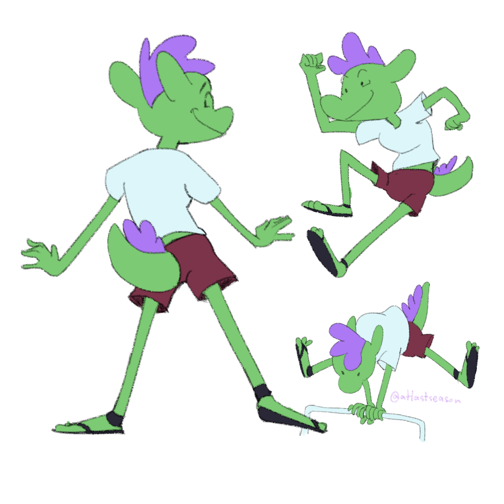

+++
title = 'Working on My Web'
date = 2024-05-15T11:13:31+07:00
tags = ['diary','web dev']
+++

Recently, I've been doing anything **but** drawing. I just don't want to forget how. So, I drew my trusty "Green Dragon" and adding a little bit of simplify and make him even more agile!

Been struggle to know if I should be planning more or just run through what I've felt is best for now. I’ve felt like this for the last two months.

I’m using Framer rather than Wordpress this time. *And* trying out some of my own, starting from scratch, by learning how to work with things like html and css. Not to mention that I’ve also get into Github and making some website on there as well.

Learning some coding and web building isn't helping me progress through art and animation side but I thought it would pay off eventually, hopefully.

It's been some eye opening that I and many artists are just hanging out and bet on our career path on some selective social media or few ways on connecting through people.

Maybe it's just me but I don't want to get stuck in or being held hostage by my own works if that said site are going out or just outright kick you out of the community that you’ve invested in.

')

So, I’ve long wanted my own place to be in. Just for my own sake, I thought. But the pessimistic side of me say that it’d loop around, eating itself, if I would to create said site and curate all of the content that I’d want to in it. It’d not be much different than many self-hosted website for artists out there.

My dream is to create place for many artists, like me, to be able to follow through their own vision of creating things and still be able to live a happy, enjoyable life in this trying time, especially in Thailand, where I’ve seen many are still trying their very best to be able to pursuit art as a career and still fulfill their own enjoyment of just making their art.

> Some ideas and notes in my notebook since early this year

Maybe the available options are enough and I am being hard and picky about it. But man, it’d be nice to have one for myself.

What do you think about it? Would you take a long journey to create somewhat workable sites for your own sake and might still not enough for the community or just suck up and bear the annoying little things that other sites had but all the people are in there?

Anyway, See you another time! Take care!

Originally posted on [Wordpress](https://naaiintouch.wordpress.com/2024/05/15/ready-get-set-pose-%f0%9f%93%b8/), 15 May 2024
