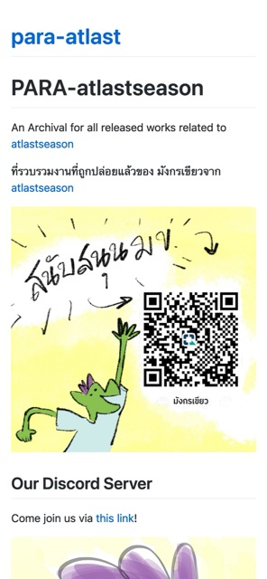

+++
title = 'First Blog from scratch'
date = 2024-12-17T20:08:22+07:00
tags = ['diary','web dev']
+++

After reading, watching and experimenting a lot about how to create blog using basic tools like markdown and github, I have finally arrived on my own ways to create my own blog and the repositories for my published artworks.

This could help me a lot for backup all my published work into an easy to find place with minimal crawling into media tabs or albums.

I will be listing how I’ve done it in the next post.

It’s been a long day for me today.

See you next blog!
