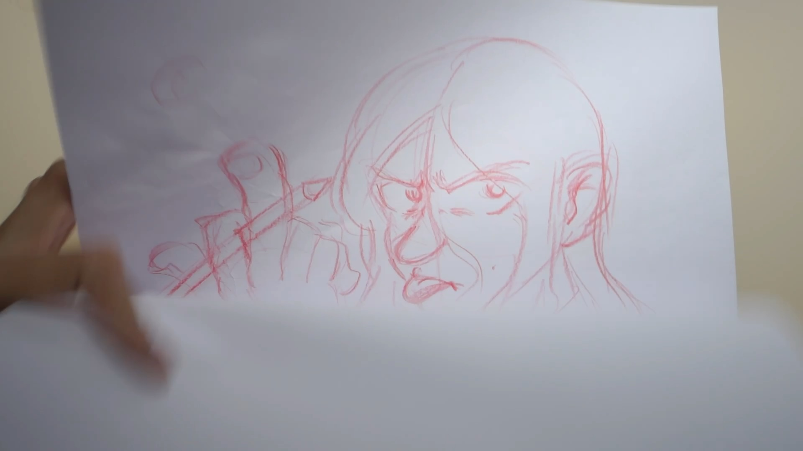

+++
title = 'Fuckit,imgoingbacktopaper!'
date = 2024-05-07T21:07:58+07:00
tags = ['paper animation','live footage']
tools = ['traditional','light table']
+++

> [Youtube Link](https://youtu.be/TWun5jTMjiA?feature=shared)

And they said paper is oldschool. I say fuck them!

It’s been frustrating whole months that I didn’t draw anything substantially after I being laid off from animation industry.
But tonight it will be different!
I’m appeared to be at my home - where my light table was. I climbed up onto the top of my closet and bring it back to life.
Thank goodness it’s still working!

I don’t have any idea on what I would draw but I think drawing me is a start. So I drew myself.
Then I began to draw, and draw and draw.

Then I scanned it on my home all-in-one printer and scanner - imported into Toonboom Harmony - adjust the timing a little bit and Voila!

My Paper-animation happens in one night because I was so eager to draw something and make a big fuss out of it lol.
